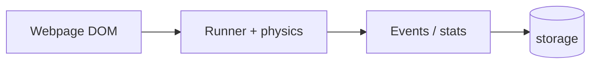
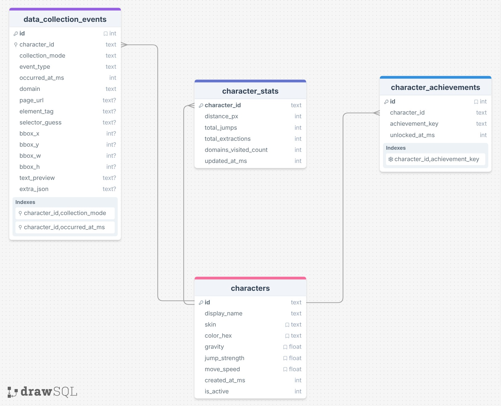
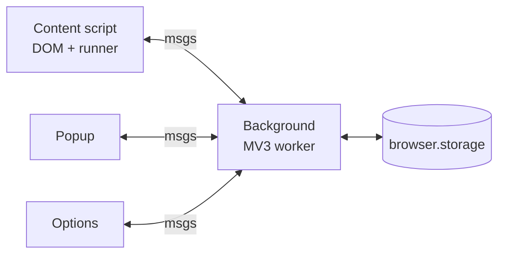

# DataMan — Initial design

## Purpose & goals

**What:** A Firefox extension that puts a tiny runner on any page. You jump across real page elements (DOM boxes). It logs jumps and optional “study” extracts, and tracks stats per character (plus achievements).

**Why:** Fun browsing + real event data (local only). Multiple characters with different looks/physics.

## Data (SQL ERD)

**Overview:** Storage centers on **`characters`** (each runner profile). All logged rows live in **`data_collection_events`**, keyed by **`character_id`** so you can filter “what this dude collected.” **`collection_mode`** splits **passive** (auto: jumps, domain visits, etc.) from **`active_extract`** (the **E** collection move). **`event_type`** tags the row (`jump`, `domain_visit`, `extraction`, …). Optional **`character_stats`** caches totals; **`character_achievements`** stores unlocks per character. DDL: `dataman_storage_schema.sql`.

## System design

- **Content script:** page overlay, collisions, sends jump/extract events.  
- **Background:** message hub, reads/writes storage.  
- **Popup / Options:** stats + pick character / edit profiles.

## Daily goals → 4/25/2026

| Date | Goal |
| --- | --- |
| 3/28 | Lock scope; note CSP/perf risks |
| 3/29 | Demo checklist (5 min) |
| 3/30 | Log IDs + size limits |
| 3/31 | Popup stats + character switch QA |
| 4/1 | Options validation + defaults |
| 4/2 | Local test HTML page |
| 4/3 | Test 5 real sites |
| 4/4 | Achievements smoke test |
| 4/5 | Perf pass (layout reads) |
| 4/6 | Privacy blurb (local-only) |
| 4/7 | README + screenshot |
| 4/8 | Core scope “done” |
| 4/9 | Collision spike start |
| 4/10 | Keep/kill collision |
| 4/11 | Fix top bugs |
| 4/12 | Small UX/copy fixes |
| 4/13 | Collision prototype (if on) |
| 4/14 | Collision fallback (if on) |
| 4/15 | ERD vs code check |
| 4/16 | Export logs or defer |
| 4/17 | Options/popup a11y pass |
| 4/18 | 10-site regression list |
| 4/19 | Lint / cleanup |
| 4/20 | Demo GIF/video |
| 4/21 | AI hook sketch (if time) |
| 4/22 | Permissions + message sanity |
| 4/23 | Version + changelog |
| 4/24 | Practice presentation |
| 4/25 | Submit / present + time log |
