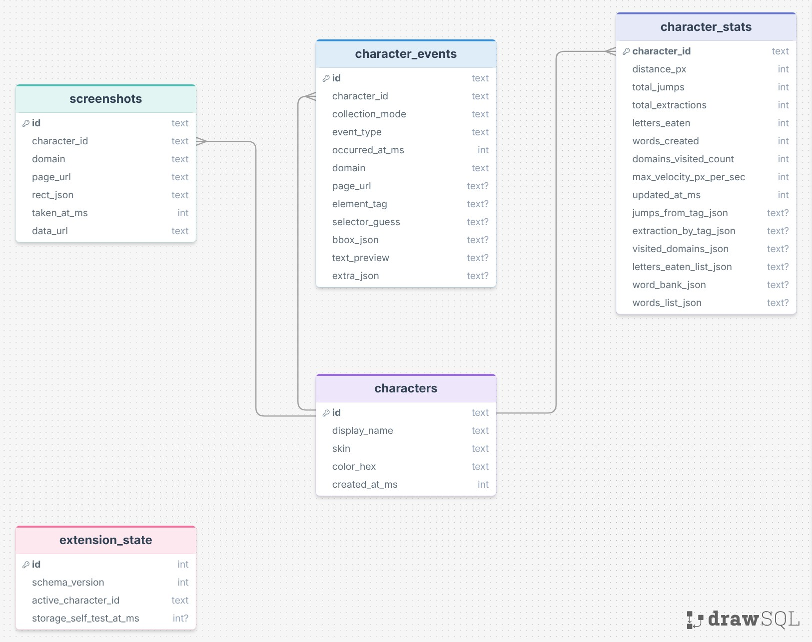
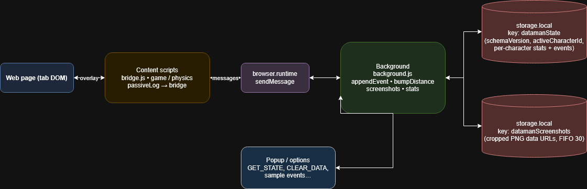

# DataMan Project Report

## Project Summary
DataMan is a browser extension project that turns web-page interaction into game mechanics while collecting data and screenshots. This creates a fun and engaging way to interact with the web while also making it more intentinal. There is a man that platforms on the web and collects data, a astroman that takes screenshots, and a snake that eats food and spits messages.

## Diagrams

- [ ] 
- [ ] 

## Demo Video or GIF

## What Did You Learn?
1. The **basics of building a browser extension**: what a content script is versus the background, how **permissions** gate what you are allowed to do, and how you load HTML/JS/CSS into the project. The **`manifest.json`** is a concrete example of that—it is the file that ties the pieces together (scripts, icons, optional `web_accessible_resources`, and so on), and you learn quickly that if the manifest is wrong, nothing else runs the way you expect.
2. **Game-style code** is a separate skill from “normal” app logic: you keep a **game loop**, update **physics/state**, then **draw**. **Sprite sheets** are a good example—one image becomes many frames, so you write code to slice the sheet, pick the right frame for idle/run/jump, and sync animation timing with velocity so movement looks believable.
3. **AI is weak at big-picture decisions** on its own: it will confidently pick structures or APIs that do not match what you wanted unless you spell things out. I got better results when I **fed the model lots of context**—how I want the feature to behave, **folder/file layout** I am aiming for, **desired stack** (plain JS, MV3, `browser.*` APIs), and constraints from the assignment—then treated the output as something to **edit and verify**, not blindly ship.

## Does Your Project Integrate With AI? Nope.

## How Did You Use AI to Build Your Project?
    - Used AI heavily to help with the project
    - Helped desgin and build fuctions, but often needed help structuring the code, so I had multiple refactors and adjustments to the code to get it to work as expected.
    - Helped get me jump started on extention making knowledge.
    - Helped with debugging and fixing bugs.

## Why This Project Is Interesting to You
I thought it would be a fun way to navigate the web and collect data about my interactions with the web. This was also a good way to learn about extension as well as game development to a degree.

### Failover Strategy
- Telemetry is stored in **`browser.storage.local`** (keys `datamanState` and `datamanScreenshots`), not on a remote server—there are no “reporting endpoints” to go down.
- Content scripts send data via **`runtime.sendMessage`**; failures are typically **ignored** (e.g. empty `.catch` in `bridge.js`) so the overlay/game does not crash if the background is unreachable.
- **Bootstrap** retries initialization after a delay if startup fails; the background handler logs errors and returns `{ ok: false, ... }` instead of throwing to the caller.

### Scaling
- **Hard caps in `background.js`:** at most **800** stored events per character, **30** screenshots total, **1000** eaten-letter entries, **500** spit-word entries—FIFO trimming when limits are exceeded.
- The **data viewer** is a separate extension page from the **content-script** game loop, so inspecting data does not run inside the per-frame game loop.

### Performance
- The main game uses **`requestAnimationFrame`** (`render.js`) with a clamped frame delta for stable physics timing.
- Gameplay drawing is **canvas-based**; periodic work (e.g. platform refresh, snake “food” scanning) touches the DOM on an interval or as needed, not on every single-frame paint.

### Concurrency
- **Popup, content scripts, and the background** communicate through **async message passing** (`sendMessage` / handlers in `background.js`).
- **Durable state** is loaded and saved in the **background** only, so there is a single writer for `datamanState` and screenshot storage instead of multiple tabs fighting over the same JSON.

---

